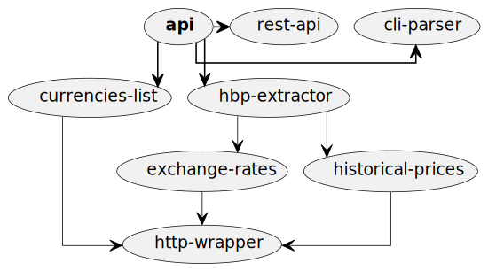

# API Guide

The whole API have been made without using any third-party module. It is completely created using in-built node modules and methods.

## API architecture

This diagram depicts the architecture of a system, highlighting the components and their relationships. Here's a detailed explanation of the architecture:

### Components

- **api**: The main API component, which is the central hub of the system.
- **cli-parser**: A command-line interface (CLI) parser component, which is connected to the API.
- **currencies-list**: A component responsible for managing a list of currencies, connected to the API and HTTP wrapper.
- **exchange-rates**: A component responsible for managing exchange rates, connected to the API, HTTP wrapper, and HBP extractor.
- **hbp-extractor**: A component responsible for extracting data from an external source (HBP), connected to the API, exchange rates, and historical prices components.
- **historical-prices**: A component responsible for managing historical prices, connected to the API, HBP extractor, and HTTP wrapper.
- **http-wrapper**: An HTTP wrapper component, which acts as an interface to external HTTP services, connected to the currencies list, exchange rates, and historical prices components.
- **rest-api**: A REST API component, connected to the API.
Relationships

The relationships between components are represented by arrows with different thicknesses and styles:

- Thick, solid lines indicate a strong, direct connection between components.
- Thin, dashed lines indicate a weaker, indirect connection between components.
- Arrowheads indicate the direction of data flow or dependency between components.

Here's a summary of the relationships:

- The API is the central component, connected to the CLI parser, currencies list, HBP extractor, and REST API.
- The currencies list and exchange rates components rely on the HTTP wrapper for external data.
- The HBP extractor extracts data from an external source and provides it to the exchange rates and historical prices components.
- The historical prices component relies on the HBP extractor and HTTP wrapper for data.

This architecture represents a data-driven system that integrates with external services (via the HTTP wrapper) and provides a REST API for clients to access the data. The system consists of several components that work together to manage and provide data related to currencies, exchange rates, and historical prices. The API component acts as a central hub, coordinating the flow of data between the different components.

### Flow

The main module, `api`, uses the `cli-parser` to extract CLI arguments and then uses the `rest-api` module to create REST APIs. 

It offers two main APIs: 

- The `currencies-list` module provides `supported-currencies`.
- The historical bitcoin prices are obtained from the `historical-prices` module by the `hbp-extractor` module, while the `exchange-rates` module provides the currency exchange rates.

The `http-wrapper` module handles all http-based communications.