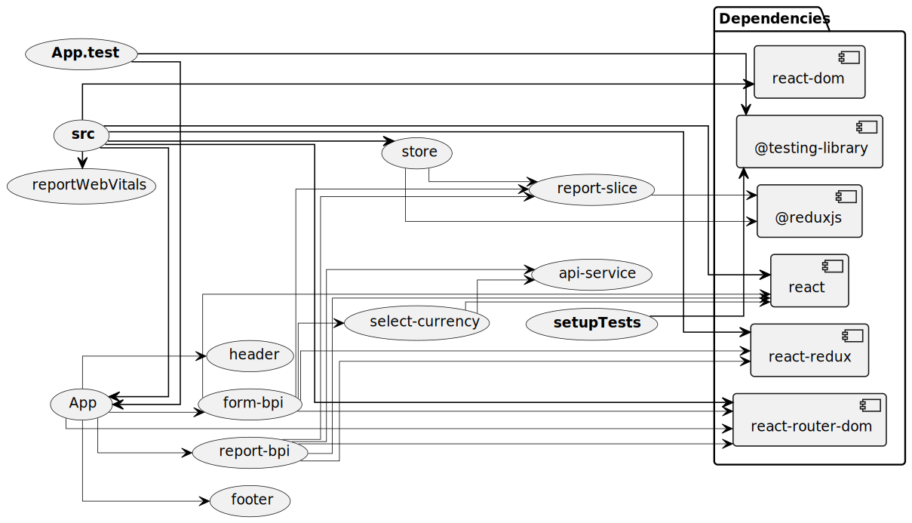

# App Guide

Application has been made using react library along with other major modules like router and redux.

## Application architecture

This diagram describes the architecture of a system, specifically the relationships between its components. Here's a breakdown of the architecture:

### Components

- **api**: The main API component, which is the central hub of the system.
- **cli-parser**: A command-line interface (CLI) parser component, which is connected to the API.
- **currencies-list**: A component responsible for managing a list of currencies, connected to the API and HTTP wrapper.
- **exchange-rates**: A component responsible for managing exchange rates, connected to the HTTP wrapper and HBP extractor.
- **hbp-extractor**: A component responsible for extracting data from an external source (HBP), connected to the exchange rates and historical prices components.
- **historical-prices**: A component responsible for managing historical prices, connected to the HBP extractor and HTTP wrapper.
- **http-wrapper**: An HTTP wrapper component, which acts as an interface to external HTTP services, connected to the currencies list, exchange rates, and historical prices components.
- **rest-api**: A REST API component, connected to the API.
Relationships

The relationships between components are represented by arrows with different thicknesses and styles:

- Thick, solid lines indicate a strong, direct connection between components.
- Thin, dashed lines indicate a weaker, indirect connection between components.
- Arrowheads indicate the direction of data flow or dependency between components.

Here's a summary of the relationships:

- The API is the central component, connected to the CLI parser, currencies list, HBP extractor, and REST API.
- The currencies list and exchange rates components rely on the HTTP wrapper for external data.
- The HBP extractor extracts data from an external source and provides it to the exchange rates and historical prices components.
- The historical prices component relies on the HBP extractor and HTTP wrapper for data.

Overall, this architecture appears to be a data-driven system that integrates with external services (via the HTTP wrapper) and provides a REST API for clients to access the data. The system consists of several components that work together to manage and provide data related to currencies, exchange rates, and historical prices.