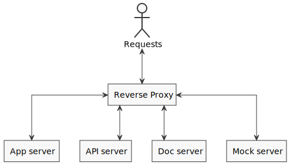

# Getting Started

Understanding the architecture of system would be beneficial so that all of the instructions that are listed below have some significance.

### System Architecture



## Prerequisite

- Node v20.12.2 or above should be installed.
- Linux required to run bash scripts.

## Configuration

There are 2 configuration scripts files:

1. For reverse proxy 

   - [proxy-config.json](proxy-config.json) for production
   - [dev-proxy-config.json](dev-proxy-config.json) for development

   In reverse proxy, the default URL of each servers are mentioned. So in case of any change in the address or port of those servers, this file should be revised.

   Note: The `dev-proxy-config.json` are specifically meant for client-side react app development.

2. For API

   - [config.json](api/config.json) for production
   - [dev-config.json](api/dev-config.json) for development

   The production configuration file consists all the third-party links whereas the development configuration file consists mock server links.

## Installation

To install any necessary dependencies, run the command

```sh
sh build.sh
```

## Usage

To run all the servers along with reverse proxy, run the command

```sh
sh run.sh
```

Now open the [localhost:8080](http://localhost:8080/) link in your browser to view the webapp. The port `8080` Has been used as a default port for the reverse proxy.

Additionally, the [localhost:8080/api/](http://localhost:8080/api/) link can be used for API requests.

## Tip

For better usability [PM2](https://pm2.keymetrics.io/) can be used in the live production environment to run these servers in scalable mode.