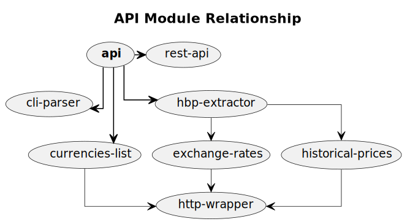
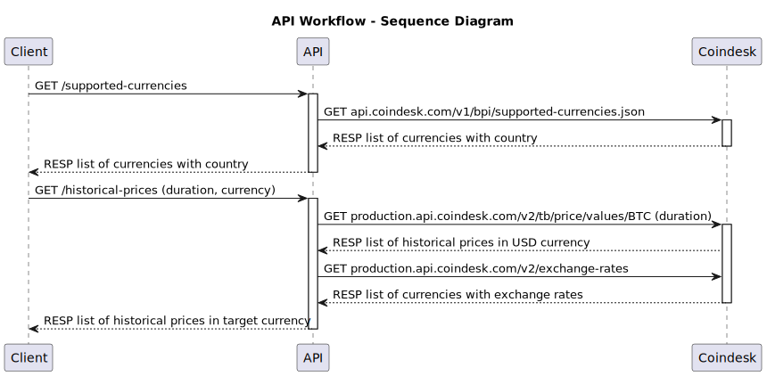

# API Guide

The whole API have been made without using any third-party module. It is completely created using in-built node modules and methods.

## API architecture



This diagram depicts the architecture of a system, highlighting the components and their relationships. Here's a detailed explanation of the architecture:

### Components

- **api**: The main API component, which is the central hub of the system.
- **cli-parser**: A command-line interface (CLI) parser component, which is connected to the API.
- **currencies-list**: A component responsible for managing a list of currencies, connected to the API and HTTP wrapper.
- **exchange-rates**: A component responsible for managing exchange rates, connected to the API, HTTP wrapper, and HBP extractor.
- **hbp-extractor**: A component responsible for extracting data from an external source (HBP), connected to the API, exchange rates, and historical prices components.
- **historical-prices**: A component responsible for managing historical prices, connected to the API, HBP extractor, and HTTP wrapper.
- **http-wrapper**: An HTTP wrapper component, which acts as an interface to external HTTP services, connected to the currencies list, exchange rates, and historical prices components.
- **rest-api**: A REST API component, connected to the API.
Relationships

The relationships between components are represented by arrows with different thicknesses and styles:

- Thick, solid lines indicate a strong, direct connection between components.
- Thin, dashed lines indicate a weaker, indirect connection between components.
- Arrowheads indicate the direction of data flow or dependency between components.

Here's a summary of the relationships:

- The API is the central component, connected to the CLI parser, currencies list, HBP extractor, and REST API.
- The currencies list and exchange rates components rely on the HTTP wrapper for external data.
- The HBP extractor extracts data from an external source and provides it to the exchange rates and historical prices components.
- The historical prices component relies on the HBP extractor and HTTP wrapper for data.

This architecture represents a data-driven system that integrates with external services (via the HTTP wrapper) and provides a REST API for clients to access the data. The system consists of several components that work together to manage and provide data related to currencies, exchange rates, and historical prices. The API component acts as a central hub, coordinating the flow of data between the different components.

### Flow

The main module, `api`, uses the `cli-parser` to extract CLI arguments and then uses the `rest-api` module to create REST APIs. 

It offers two main APIs: 

- The `currencies-list` module provides `supported-currencies`.
- The historical bitcoin prices are obtained from the `historical-prices` module by the `hbp-extractor` module, while the `exchange-rates` module provides the currency exchange rates.

The `http-wrapper` module handles all http-based communications.

For further understanding, you can refer the API workflow sequence diagram given below.



## Build, Test & Deploy  

### Build

Since this API doesn't have any third party module dependency, so it doesn't require build. 

### Testing

To test the API, run this command

```sh
npm run test
```

Alternatively, run this command

```sh
sh test.sh
```

It will launch the API server, the mock server, and the reverse-proxy server, then run all of the test scenarios and report the results on the console before exiting.

### Deploy

The entire directory can be uploaded and deployed on the target server.

The API server can then be started using this command

```sh
node api.js -a=0.0.0.0 -p=8081
```

Moreover, it can be also be deployed on a docker using this command

```sh
sh docker.sh
```

## Challenges

Probably, after Bullish acquired Coindesk, the Coindesk API documentation is no longer available on their official portal. The old API documentation link has been redirected to the homepage, where no API documentation link can be found, forcing me to practically hack their website to locate the most recent version of APIs.

### Finding the suitable API for historical prices 

The historical closing price can be fetched via 2 APIs of Coindesk although different versions.

- [api.coindesk.com/v1/bpi/historical/close](https://api.coindesk.com/v1/bpi/historical/close)

  This API returns data within a specified range, however it has a cooling down period after a request, so it may return the same data for a while even if the parameters are different each time. Thus, using this API is unreliable.

- [production.api.coindesk.com/v2/tb/price/values/BTC](https://production.api.coindesk.com/v2/tb/price/values/BTC)

  Every time, this API returns the data in the chosen range depending on the range that is supplied. Lacks the cooling time found in the prior one. Therefore, using the API is more dependable.

### Finding the suitable API for exchange rates

In addition, I had previously used the [openexchangerates.org/api/latest.json](http://openexchangerates.org/api/latest.json?app_id=APP_ID) API to obtain the exchange rates, but it had a quota, so I had to look for another  API, preferrably from Coindesk that is unrestricted. 

Eventually, I discovered [coindesk.com/pf/api/v3/content/fetch/exchange-rates](https://www.coindesk.com/pf/api/v3/content/fetch/exchange-rates), the Coindesk's v3 exchange rates API, but for some reason, it was not compatible with the Node.js app, and all requests were denied (forbidden). 

After much reverse engineering of their website, I was able to locate [production.api.coindesk.com/v2/exchange-rates](https://production.api.coindesk.com/v2/exchange-rates), the Coindesk's v2 API for exchange rates, which is adequate for this application and has no limitations.